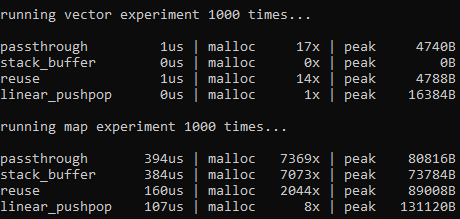

# Allocator Experiment I

Simple experiment with using custom allocators. 



## What & why are custom allocators?

Allocating memory is expensive—at least, if you do it very often. Memory allocations often have to go to the OS to ask for more, which takes longer than reusing existing allocated memory. Custom allocators allow strategies for getting memory that do fewer but larger allocations.

## What types of allocators are these?

* passthrough - essentially normal behaviour, `malloc`
* stack_buffer - a small buffer on the stack which supplies memory until it runs out, after which the heap is used
* reuse - when memory is freed it is put in a (sort of) linked list to be reused
* linear_pushpop - an 'arena allocator', it allocates large amounts of memory at once; it has a 'stack pointer'-esque construction to allow its end point to be reset to reuse memory

## How performant are these?

In a release build shown above you can see the 'map experiment' (repeatedly adding and removing entries in maps) the linear_pushpop is significantly faster than a passthrough. This makes sense, as standard library maps allocate and free a lot of memory. It also uses a lot more memory; but for temporarily used memory that usually isn't so much a problem.

Its also interesting to note that the stack_buffer does zero allocations in the vector experiment (adding elements to a vector); this means the memory used was within the memory it obtained on the stack. This is useful for small allocations, though the linear_pushpop would provide the same functionality without the limitations of stack memory.

## Are these good allocators?

I very much enjoyed making these as an experiment, so I would say they are more fun than good

## How to use them?

An unordered map with a custom allocator can be as simple as
```
using linear_pushpop = gaos::allocators::linear_pushpop<1 << 14, gaos::allocators::libc<std::byte>>;

linear_pushpop pushpop;
std::unordered_map<int, int, std::hash<int>, std::equal_to<int>, linear_pushpop> test(pushpop);
```
i.e., define an allocator with a fixed minimal page size, with a sub-allocator that it uses to allocate its pages (in this case a standard `malloc`), then create an instance of the allocator and use it to initialise the map

It's quite fun and a nice demonstration of low level memory management working to a speed advantage. But always remember that YMMV.
